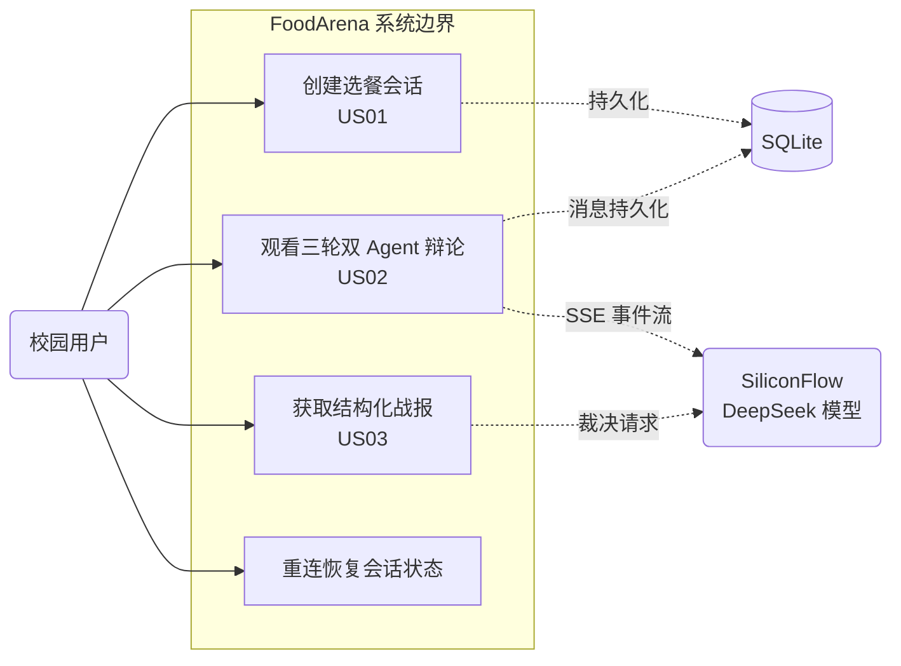
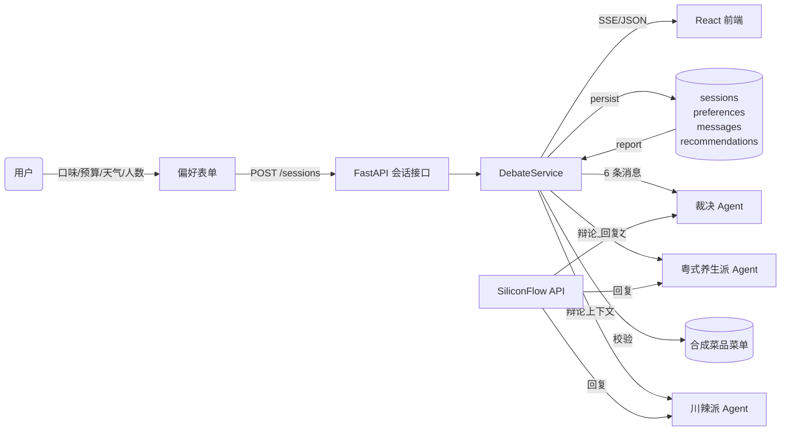
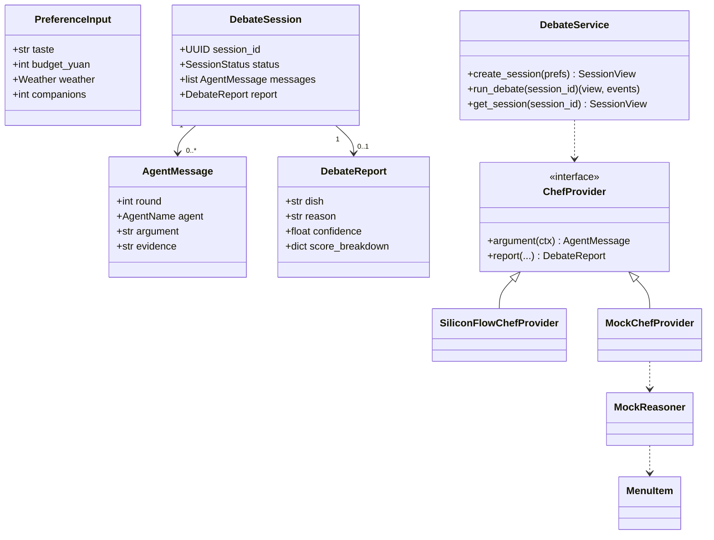
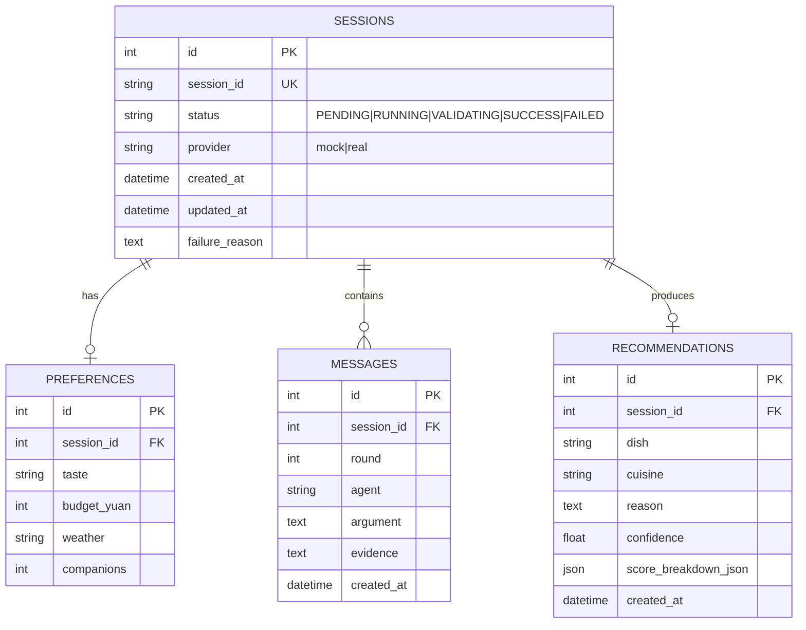
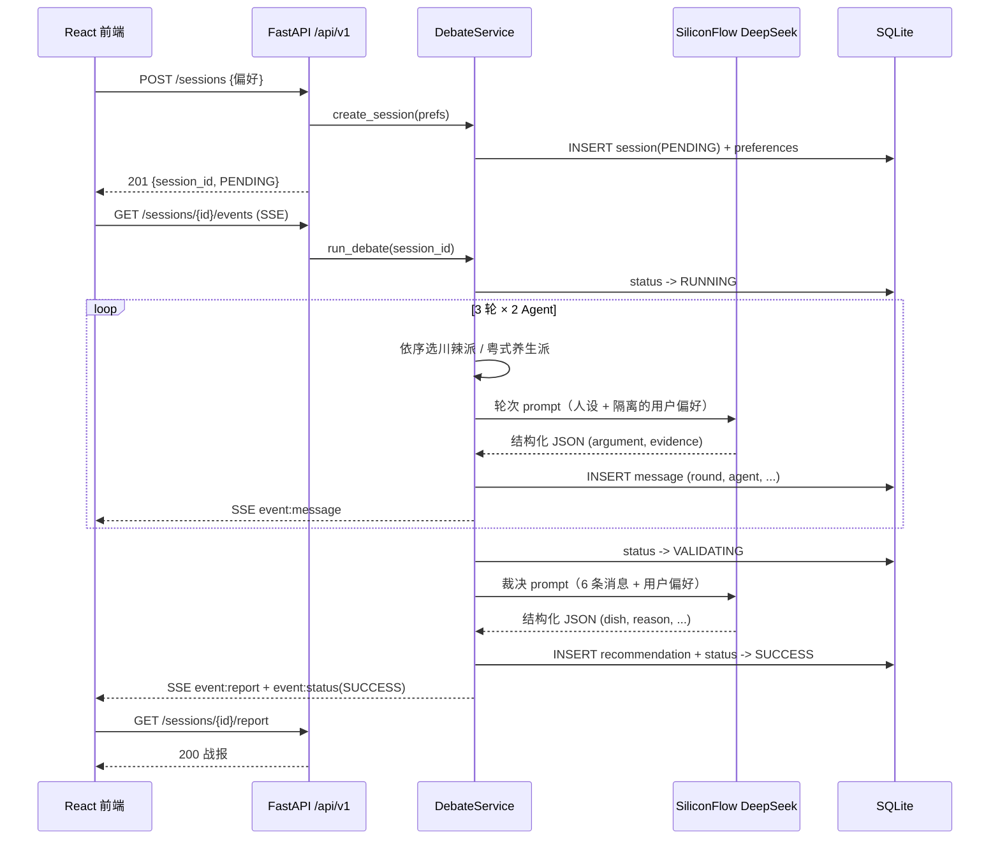
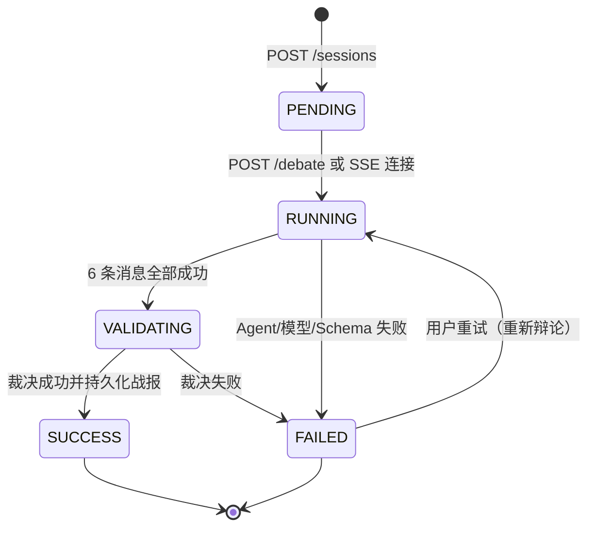

# FoodArena AI — 系统设计规约（三大模型 · 六图体系）

> 校园干饭辩论赛与美食擂台：基于敏捷方法的 AI 原生选餐决策应用。
> 本文件按《工程实践指导书》的「系统级三大模型 6 大架构图」要求绘制并维护
> 系统顶层设计。图用 Mermaid 编写，可直接在 GitHub 渲染。

- 图 1 系统顶层用例图（功能模型）
- 图 2 系统数据流图 DFD（功能模型）
- 图 3 系统领域类图（数据模型）
- 图 4 数据库实体关系图 ER（数据模型）
- 图 5 端到端核心时序图（动态模型）
- 图 6 会话生命周期状态机图（动态模型）

---

## 图 1 · 系统顶层用例图

---

## 图 2 · 系统数据流图（DFD）

---

## 图 3 · 系统领域类图

---

## 图 4 · 数据库实体关系图（ER）

约束：`preferences.session_id` 唯一（每个会话一份偏好）；`recommendations.session_id`
唯一（最终战报仅一份）；`messages` 按 `id` 排序即发言顺序。

---

## 图 5 · 端到端核心时序图

---

## 图 6 · 会话生命周期状态机图

补充说明

- 只有 `PENDING` 允许启动辩论；重复启动/已完成会话再次调用返回当前状态，
  绝不产生第二条执行链（图 5 中 `run_debate` 的幂等语义）。
- `FAILED` 会话永不返回伪造的成功战报：`GET /report` 仅对 `SUCCESS` 开放，
  否则返回 `409`。
