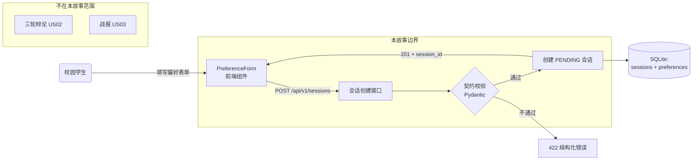
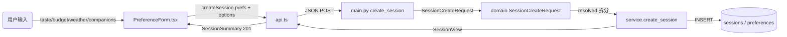
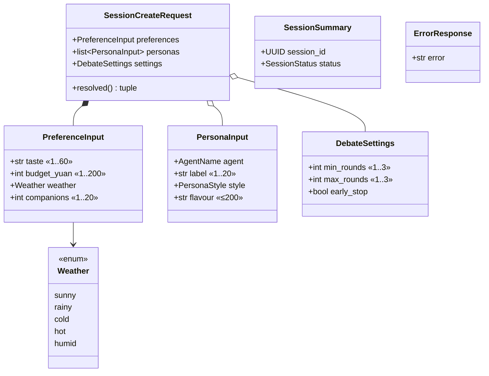
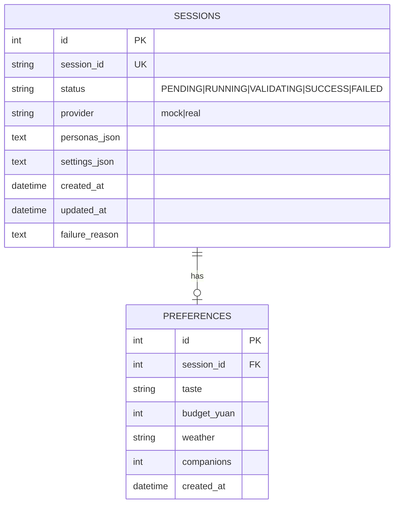
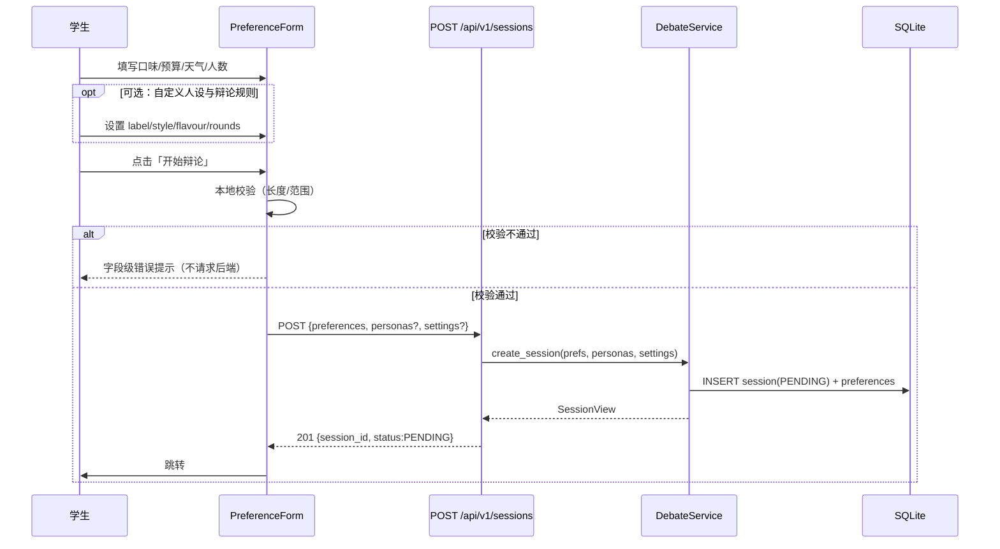
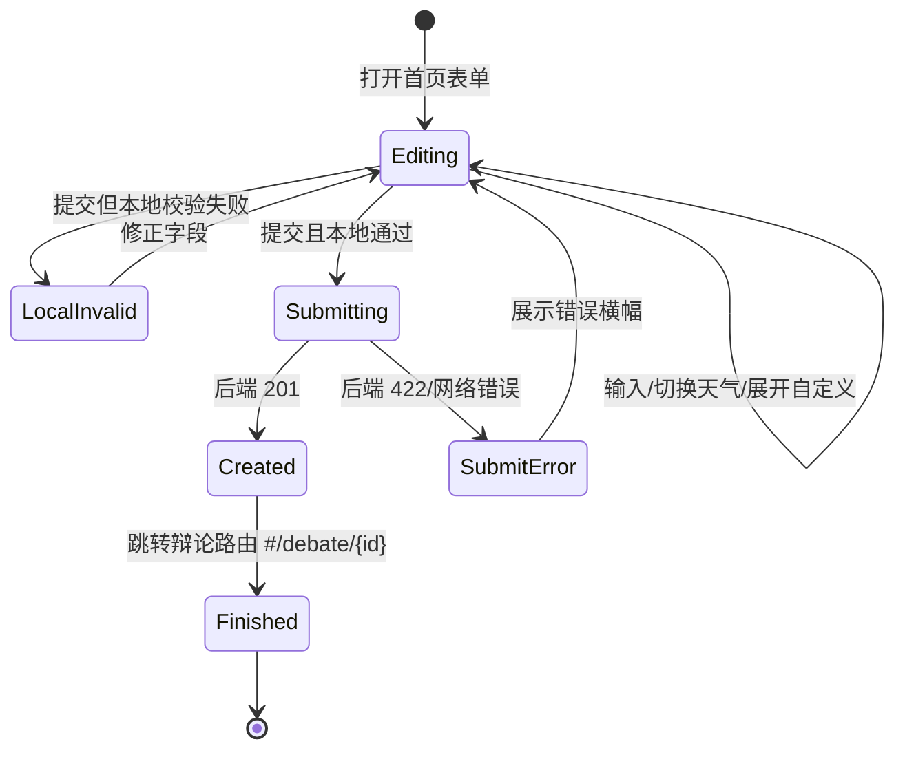

# US01 · 偏好表单与会话创建

> 对应 Issue：[#2 [S1][US01] 偏好表单与会话创建](https://github.com/wujiade-2005/foodarena-ai/issues/2)
> 负责人：吴佳德（PO/Frontend） · Story Points：5 · Sprint：1 · Priority：P0 · Work Type：User Story

---

## 一、用户故事（Card）

**作为** 一名校园学生，
**我希望** 输入口味、预算、天气与同行人数并创建会话，
**以便** 启动一次可追踪、可回放的选餐辩论。

## 二、3C 理论

- **Card（卡片）**：一句话故事，见上。
- **Conversation（对话）**：核心澄清点是"能否只用一次请求就把偏好带全"以及"非法输入是否要建会话"。团队结论：偏好 + 可选自定义人设/辩论设置一次提交；非法输入**不落库**，直接返回结构化错误。
- **Confirmation（确认）**：以下 Gherkin 场景 + DoD 清单。

### INVEST 自检

| 原则 | 说明 |
|---|---|
| Independent | 仅依赖领域契约，不依赖辩论/裁决逻辑 |
| Negotiable | 字段范围（预算 1–200、人数 1–20）可协商 |
| Valuable | 无会话则整个产品无法启动 |
| Estimable | 契约明确，5 SP |
| Small | 单个 Sprint 内可完成 |
| Testable | 201/422/唯一 id/PENDING 均可断言 |

## 三、验收标准（Gherkin / BDD）

```gherkin
Scenario: 提交合法偏好创建会话
  Given 用户提交合法的口味、预算、天气与人数
  When 调用 POST /api/v1/sessions
  Then 系统创建状态为 PENDING 的会话
  And 返回唯一 session_id

Scenario: 提交非法偏好被拒绝
  Given 用户提交空口味或预算 0 的偏好
  When 调用 POST /api/v1/sessions
  Then 系统返回 HTTP 422 结构化校验错误
  And 不创建任何会话
```

> 可执行文件：[tests/features/US01_session.feature](../../tests/features/US01_session.feature)

---

## 四、故事级六图建模

### 图 1 · 故事用例 / 边界图（Story Context & Scope）



**前置条件**：菜单/契约已就绪。**后置条件**：库中存在一条 `PENDING` 会话，含 1 条 preferences 记录。

### 图 2 · 故事组件 / 数据流图（Story Component / Data Flow）



输入 → AI 算子的说明：本故事是**无 LLM 的确定性路径**（不触发任何模型调用），AI 算子为空；数据流止于持久化。这是刻意的：会话创建必须快且可预测。

### 图 3 · 故事领域类与数据契约图（Pydantic Schema）



契约要点：`SessionCreateRequest` 通过 `model_validator` 同时兼容**嵌套体**（`{preferences, personas?, settings?}`）与**扁平偏好体**，保证旧客户端不破坏。

### 图 4 · 故事数据实体 / 持久化模型（ER / State Schema）



本故事只写 `sessions`（status=PENDING）与 `preferences` 两表；`messages`/`recommendations` 由 US02/US03 写入。

### 图 5 · 故事端到端时序图（Story Sequence）



### 图 6 · 故事微观状态与活动流程图（State Machine & Activity）



---

## 五、Definition of Done 对照

| DoD 项 | 证据 |
|---|---|
| 验收标准全部通过 | `tests/features/US01_session.feature`（BDD）+ `tests/test_api.py` |
| 自动化测试已补充 | 合法 201 / 非法 422 / 不落库断言 |
| 文档与契约同步 | 本文档 + `docs/system_design.md` 图 3/4 |
| 通过 PR + Review + CI | `.github/workflows/ci.yml` 后端 job |
| 未提交密钥/个人信息 | 仅合成偏好，无 PII |

## 六、实现索引

| 层 | 文件 |
|---|---|
| 前端表单 | [frontend/src/components/PreferenceForm.tsx](../../frontend/src/components/PreferenceForm.tsx) |
| 前端 API | [frontend/src/api.ts](../../frontend/src/api.ts) |
| 路由 | [frontend/src/App.tsx](../../frontend/src/App.tsx) |
| 请求模型 | [src/foodarena_ai/domain.py](../../src/foodarena_ai/domain.py)（`SessionCreateRequest`） |
| 端点 | [src/foodarena_ai/main.py](../../src/foodarena_ai/main.py)（`POST /api/v1/sessions`） |
| 服务 | [src/foodarena_ai/service.py](../../src/foodarena_ai/service.py)（`create_session`） |
| 持久化 | [src/foodarena_ai/db.py](../../src/foodarena_ai/db.py)（`SessionRow`/`PreferenceRow`） |
