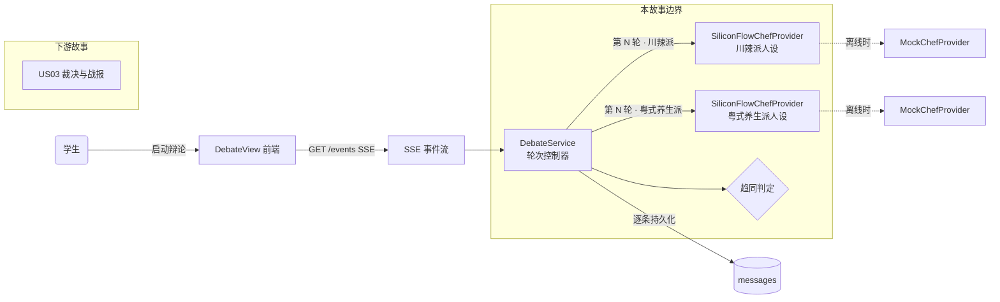
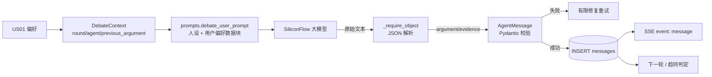
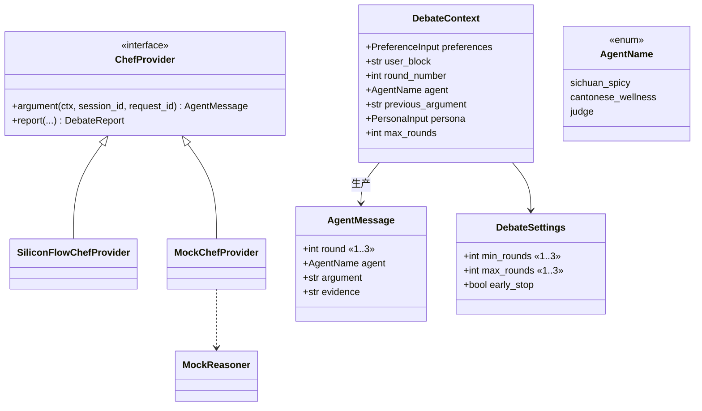
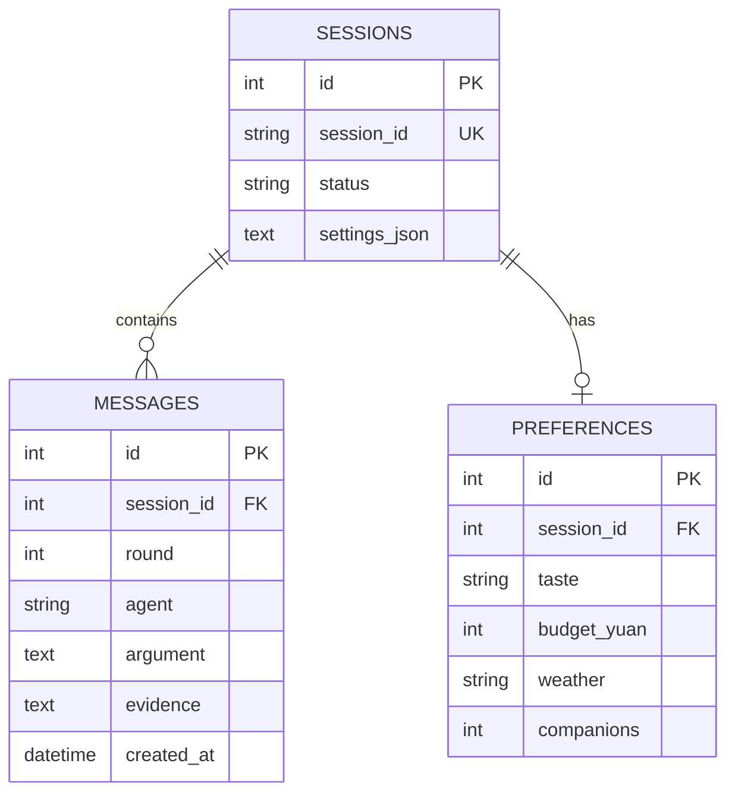
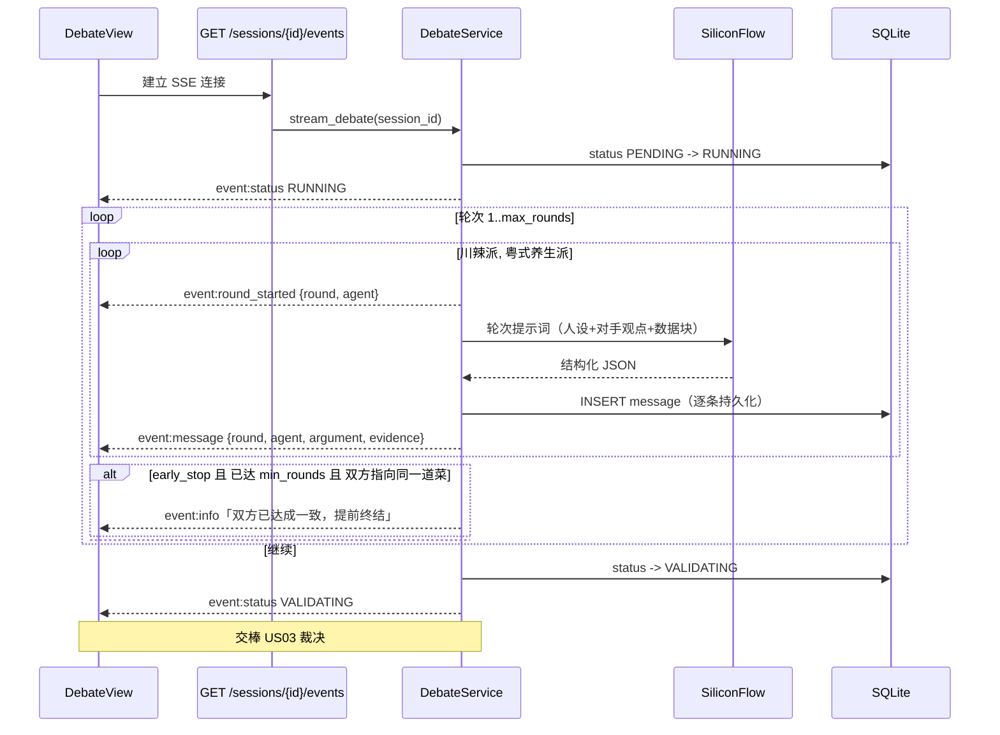
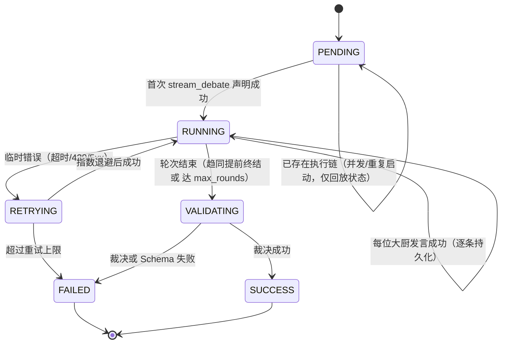

# US02 · 完整三轮双 Agent 辩论

> 对应 Issue：[#5 [S1][US02] 轮次控制骨架](https://github.com/wujiade-2005/foodarena-ai/issues/5) ·
> [#10 [S2][US02] 完整三轮双 Agent 辩论链](https://github.com/wujiade-2005/foodarena-ai/issues/10)
> 负责人：林翔宇（Backend/AI） · Story Points：5 + 8 · Sprint：1 & 2 · Priority：P0

---

## 一、用户故事（Card）

**作为** 一名犹豫不决的学生，
**我希望** 看到川辣派与粤式养生派有序地轮流发言、互相辩驳，
**以便** 获得透明而非黑盒的推荐过程。

## 二、3C 理论

- **Card**：见上。
- **Conversation**：争点集中在三处——(1) 谁先发言、如何保证交替不乱序；(2) 模型偶发失败或输出不合规时如何不产生重复/残缺消息；(3) 是否必须跑满 3 轮。团队结论：固定顺序 川→粤 循环；逐条持久化 + Schema 校验；引入**趋同提前终结**，最短可 2 轮收尾。
- **Confirmation**：下述 Gherkin + 状态机断言。

### INVEST 自检

| 原则 | 说明 |
|---|---|
| Independent | 依赖 US01 的会话与契约，不依赖 US03 的裁决 |
| Negotiable | 轮数与终止策略可配置（`DebateSettings`） |
| Valuable | 这是产品的核心体验——"可见的辩论" |
| Estimable | 轮次控制器结构明确，5+8 SP |
| Small | S1 做 Mock 骨架，S2 接真实模型，分两步可交付 |
| Testable | 消息数/顺序/字段/状态均可断言 |

## 三、验收标准（Gherkin / BDD）

```gherkin
Scenario: Mock 流程生成六条交替消息
  Given 会话处于 RUNNING 状态并执行轮次控制器的 Mock 流程
  When 执行控制器
  Then 两个 Agent 交替完成 3 轮共 6 条消息
  And 同一 Agent 不连续发言
  And 每条消息包含 round、agent、argument 与 evidence
  And 会话状态推进到 VALIDATING

Scenario: 重复启动不产生第二条执行链
  Given 会话已完成辩论并再次调用启动接口
  When 再次启动
  Then 返回当前 SUCCESS 状态且消息数量仍为 6
```

补充断言（自动化测试覆盖）：

- 单次临时错误可恢复且**不得产生重复消息**（`tests/test_service.py`）。
- 并发两次启动时**原子地只允许一条执行链**完成 6 条消息，另一路只拿到当前状态（`tests/test_resilience.py::test_concurrent_starts_atomically_claim_one_debate_chain`）。

> 可执行文件：[tests/features/US02_debate.feature](../../tests/features/US02_debate.feature)

---

## 四、故事级六图建模

### 图 1 · 故事用例 / 边界图



### 图 2 · 故事组件 / 数据流图



**AI 算子**：`debate_user_prompt` —— 注入当前轮次、己方人设、对手上一轮观点、以**数据块**包裹的用户偏好，并要求单一 JSON 输出。

### 图 3 · 故事领域类与数据契约图



### 图 4 · 故事数据实体 / 持久化模型



`messages` 按 `id` 自增排序即发言顺序；一轮两位大厨各写一行。

### 图 5 · 故事端到端时序图



### 图 6 · 故事微观状态与活动流程图



---

## 五、终止条件判定（本故事的重点）

| 规则 | 说明 |
|---|---|
| 硬上限 | `max_rounds`（默认 3）轮，未趋同则跑满 |
| 最小轮数 | `min_rounds`（默认 2）轮之前不判定提前终结 |
| 趋同判定 | 每轮结束后，若两位大厨最新论点**都指向菜单中的同一道菜**，则提前终结 |
| 开关 | `early_stop`（默认开）；关闭后永远跑满 |

**设计理由**：避免在双方已达成一致时继续无意义的冗长辩论（省 LLM 调用、降低延迟），同时在分歧大时保证充分交锋。判定基于加载菜单的菜名匹配，避免误判。

## 六、Definition of Done 对照

| DoD 项 | 证据 |
|---|---|
| 验收标准全部通过 | `tests/features/US02_debate.feature` + `tests/test_service.py` + `tests/test_resilience.py` |
| 自动化测试已补充 | 6 条交替、幂等、并发原子性、失败恢复、提前终结 |
| 文档与契约同步 | 本文档 + `docs/system_design.md` 图 5/6 |
| 通过 PR + Review + CI | CI 后端 job |
| 未提交密钥/PII | 用户偏好脱敏；日志脱敏 |

## 七、实现索引

| 层 | 文件 |
|---|---|
| 轮次控制（S1 骨架） | [src/foodarena_ai/debate.py](../../src/foodarena_ai/debate.py)（`DebateController`） |
| 编排核心 | [src/foodarena_ai/service.py](../../src/foodarena_ai/service.py)（`stream_debate`） |
| 提示词 | [src/foodarena_ai/prompts.py](../../src/foodarena_ai/prompts.py) |
| 真实提供方 | [src/foodarena_ai/providers.py](../../src/foodarena_ai/providers.py) · [siliconflow.py](../../src/foodarena_ai/siliconflow.py) |
| 离线提供方 | [src/foodarena_ai/reasoning.py](../../src/foodarena_ai/reasoning.py) |
| 前端流式 | [frontend/src/useLiveSession.ts](../../frontend/src/useLiveSession.ts) · [DebateView.tsx](../../frontend/src/components/DebateView.tsx) |
