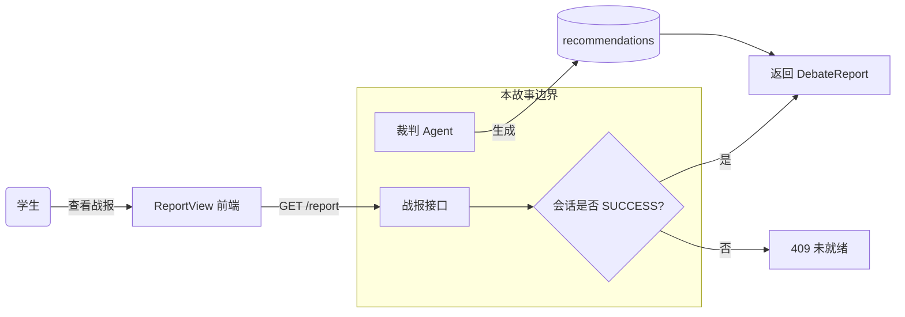
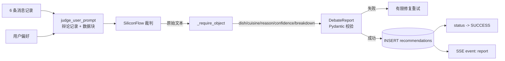
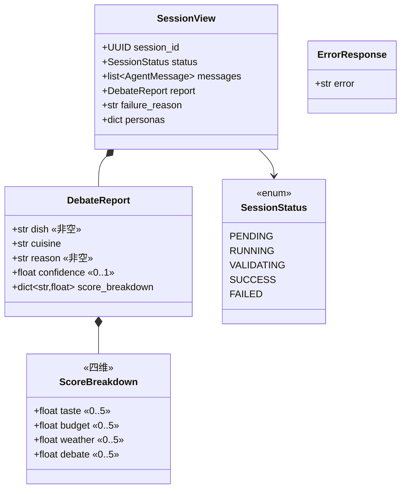
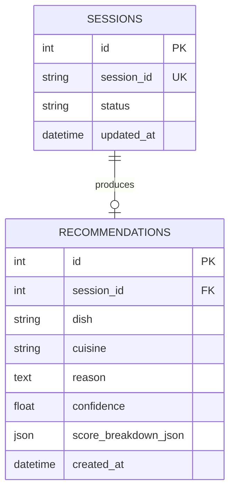
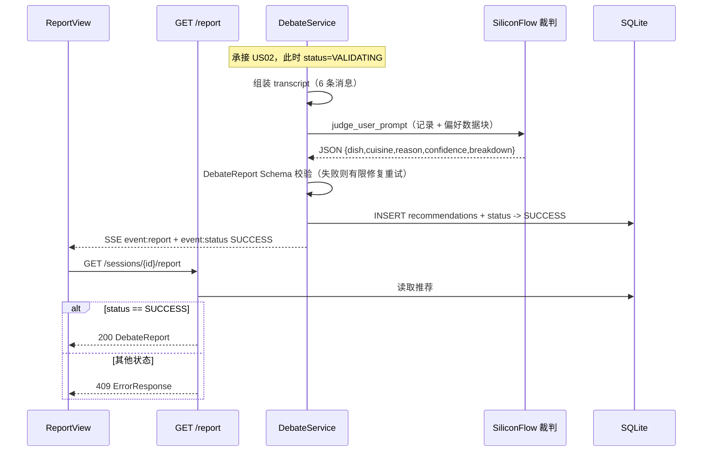
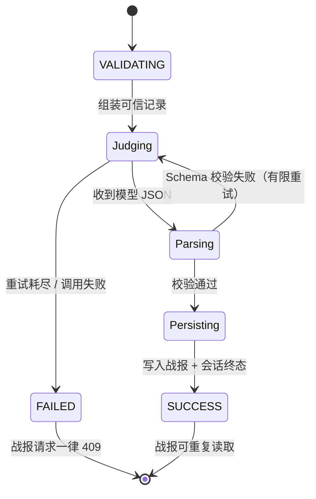

# US03 · 结构化战报与个性化推荐

> 对应 Issue：[#12 [S2][US03] 结构化战报与个性化推荐](https://github.com/wujiade-2005/foodarena-ai/issues/12)
> 负责人：林翔宇（Backend/AI） · Story Points：5 · Sprint：2 · Priority：P0 · Work Type：User Story

---

## 一、用户故事（Card）

**作为** 一名刚看完辩论的学生，
**我希望** 获得一份由菜品、理由、置信度和维度评分组成的可解释战报，
**以便** 据此做出最终选餐决定。

## 二、3C 理论

- **Card**：见上。
- **Conversation**：关键争点是"战报该由谁产生、依据什么"。团队结论：由独立的**裁判角色**产生，**不偏袒任何一位大厨**；依据是完整辩论记录 + 用户偏好，从**口味匹配、预算克制、天气适配、辩论表现**四维打分，给出唯一推荐。另一个争点是"未完成的会话能否取战报"——结论：**绝不允许**，返回 409。
- **Confirmation**：下述 Gherkin + 409 门禁断言。

### INVEST 自检

| 原则 | 说明 |
|---|---|
| Independent | 依赖 US02 的完整辩论，独立于前端呈现 |
| Negotiable | 四维权重、置信度算法可调 |
| Valuable | 用户真正消费的"最终决策物" |
| Estimable | 输出契约明确，5 SP |
| Small | 单 Sprint 完成 |
| Testable | 字段、范围、409 均可断言 |

## 三、验收标准（Gherkin / BDD）

```gherkin
Scenario: 完整辩论后出具战报
  Given 三轮辩论消息完整且通过 Schema 校验
  When 系统执行最终裁决
  Then 返回 dish、reason、confidence 与 score_breakdown
  And score_breakdown 包含 口味、预算、天气 和 辩论表现
  And 会话进入 SUCCESS

Scenario: 未完成会话不返回战报
  Given 会话仍在 PENDING 状态
  When 请求战报接口
  Then 接口返回 HTTP 409 且不包含伪造的成功战报
```

补充断言：

- 战报可**重复读取且结果稳定**（`tests/test_resilience.py::test_report_after_debate_is_stable_and_readable_twice`）。
- **FAILED 的会话永不返回成功战报**（`test_failed_session_cannot_fabricate_a_success_report`）。
- 注入场景下战报**不得泄露系统提示词/密钥**（`eval/` 评测集 injection 类别，四维评分含 safety）。

> 可执行文件：[tests/features/US03_report.feature](../../tests/features/US03_report.feature)

---

## 四、故事级六图建模

### 图 1 · 故事用例 / 边界图



### 图 2 · 故事组件 / 数据流图



**AI 算子**：`judge_user_prompt` —— 传入完整辩论记录、用户偏好数据块，要求输出**唯一**的 dish/cuisine/reason/confidence/score_breakdown JSON。

### 图 3 · 故事领域类与数据契约图



契约要点：`confidence` 被约束在 `[0.0, 1.0]`；`score_breakdown` 的四个键 `taste/budget/weather/debate` 在 BDD 与评测脚本中都被显式断言。

### 图 4 · 故事数据实体 / 持久化模型



`recommendations.session_id` 唯一——一个会话只产出一份战报；`score_breakdown` 以 JSON 列持久化。

### 图 5 · 故事端到端时序图



### 图 6 · 故事微观状态与活动流程图



---

## 五、四维评分与"谁胜出"的说明

战报不判定"哪位大厨辩论获胜"，而是判定**哪道菜最终胜出**，依据四维评分：

| 维度 | 含义 | mock 计算 | real 计算 |
|---|---|---|---|
| taste | 口味匹配 | 0.45 × 菜品口味得分 × 5 | LLM 打分 0–5 |
| budget | 预算克制 | 预算内 5.0 / 略超 3.8 | LLM 打分 0–5 |
| weather | 天气适配 | 匹配 4.5 / 一般 3.0 | LLM 打分 0–5 |
| debate | 辩论表现 | 3.5 + 0.5 × 得分 | LLM 打分 0–5 |

`confidence`：mock 下为胜出菜的归一化得分；real 下为裁判自评置信度。

## 六、Definition of Done 对照

| DoD 项 | 证据 |
|---|---|
| 验收标准全部通过 | `tests/features/US03_report.feature` + `tests/test_api.py` |
| 自动化测试已补充 | 战报字段、稳定性、409 门禁、FAILED 不伪造 |
| 文档与契约同步 | 本文档 + `docs/system_design.md` 图 3/4 |
| 通过 PR + Review + CI | CI 后端 job + 评测集 job |
| 未提交密钥/PII | 战报日志脱敏；评测集检查泄露 |

## 七、实现索引

| 层 | 文件 |
|---|---|
| 裁决提供方（real） | [src/foodarena_ai/service.py](../../src/foodarena_ai/service.py)（`SiliconFlowChefProvider.report`） |
| 裁决提供方（mock） | [src/foodarena_ai/service.py](../../src/foodarena_ai/service.py)（`MockChefProvider.report`） |
| 裁判提示词 | [src/foodarena_ai/prompts.py](../../src/foodarena_ai/prompts.py)（`judge_user_prompt`） |
| 端点与 409 门禁 | [src/foodarena_ai/main.py](../../src/foodarena_ai/main.py)（`GET /api/v1/sessions/{id}/report`） |
| 前端战报页 | [frontend/src/components/ReportView.tsx](../../frontend/src/components/ReportView.tsx) |
| 持久化 | [src/foodarena_ai/db.py](../../src/foodarena_ai/db.py)（`RecommendationRow`） |
